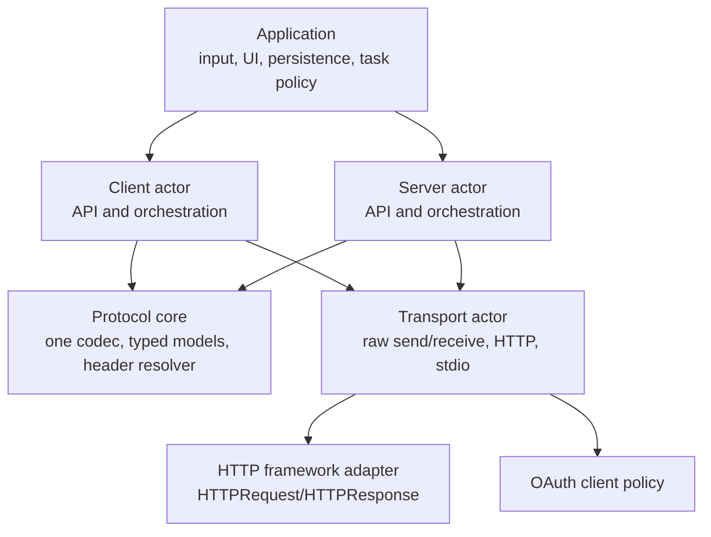
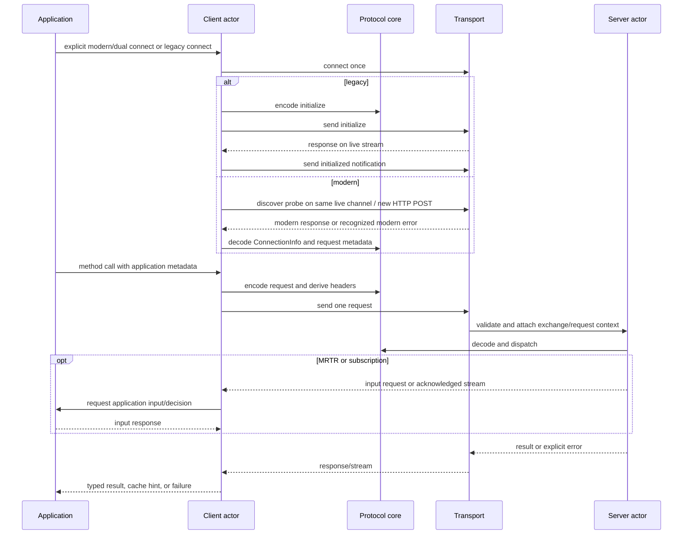
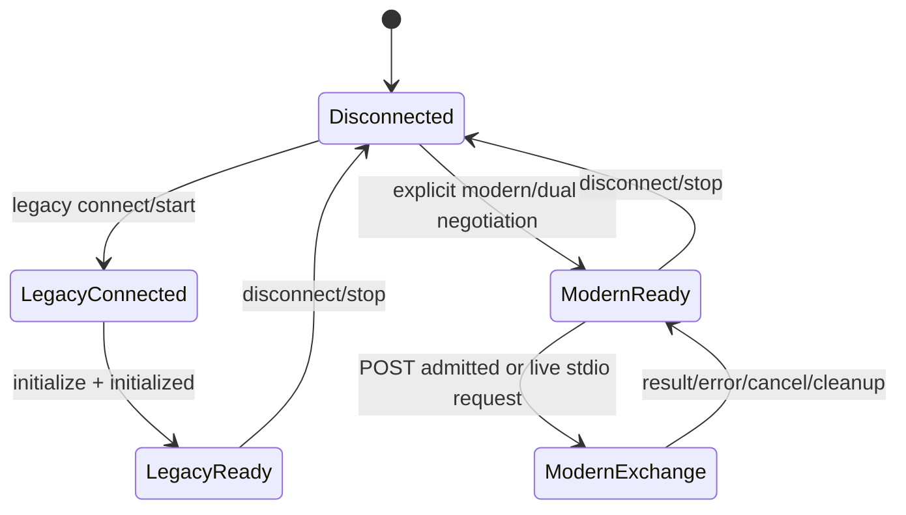

# MCP Swift SDK

## Purpose and Scope

This document is the system and SwiftPM package design master for `mcp-swift-sdk`.
The repository contains one library package, one `MCP` library module, and two
conformance executable targets. The design describes the dual-era implementation
boundary for the supported MCP legacy family (`2024-11-05` through
`2025-11-25`) and `2026-07-28` modern behavior.

The package root is also the system root, so this is the only root/package
design master. The module and target designs below own their implementation
contracts; this document owns composition, global invariants, and requirement
traceability.

Parent: none.

Children:

- [MCP module](Sources/MCP/DESIGN.md)

## Responsibilities and Boundaries

This root owns the package dependency direction, the dual-era vocabulary, the
global compatibility and resource invariants, and the frozen conformance scope.
It does not own request dispatch, wire encoding, HTTP I/O, OAuth policy, or
application input and persistence.

The package exposes the following stable boundary:

| Boundary | Owner | Not owned by the boundary |
| --- | --- | --- |
| API and orchestration | `Client` and `Server` actors | byte framing, HTTP headers, application storage |
| Protocol core | one state-free codec, typed models/errors, and one pure tool-header resolver | transport connections, retries, handler tasks |
| Transport | existing public `Transport` actor and HTTP/stdio mechanics | MCP method semantics, user input, persistence |
| Application | the package consumer | SDK mutable protocol state and wire validation |

The conformance executables are test adapters. They exercise public SDK paths
and do not become a second protocol implementation.

## Related Designs

| Design | Relationship | Contract used | Cautions |
| --- | --- | --- | --- |
| [MCP module](Sources/MCP/DESIGN.md) | child/composition root | public module exports and dependency direction | keep the one-module SwiftPM structure |
| [Base protocol core](Sources/MCP/Base/DESIGN.md) | child of the module | state-free values, messages, metadata, and typed protocol errors | no transport import or connection state |
| Base utilities | part of Base | request-scoped metadata, progress, cancellation, and request context values | values do not own a connection or task store |
| [Transport](Sources/MCP/Base/Transports/DESIGN.md) | child of Base | raw `Transport` compatibility and exchange lifetime | JSON-RPC IDs are not HTTP exchange IDs |
| HTTP server transport | part of Transport | modern POST validation and legacy HTTP compatibility | HTTP framework adapters remain outside the SDK |
| [Authorization](Sources/MCP/Base/Authorization/DESIGN.md) | child of Base | OAuth discovery, validation, token, and registration client policy | it does not implement an authorization server |
| [Client](Sources/MCP/Client/DESIGN.md) | child of the module | connection negotiation, pending requests, MRTR, and subscriptions | no concrete transport downcast or persistence |
| [Server](Sources/MCP/Server/DESIGN.md) | child of the module | handler dispatch, discovery, request context, MRTR validation, and subscription semantics | no HTTP parsing or client UI |
| Conformance executables | package test adapters | pinned scored invocation through public APIs | adapter code does not become a second protocol implementation |

## Architecture

The dependency direction is one-way at each boundary. `Core` is state-free and
does not depend on `Transport`; transport adapters do not call method handlers.
`Client` and `Server` own orchestration state and use only transport and core
contracts. The application owns user decisions, persistence, and any task
workflow around a tool call.

## Contracts and Invariants

### Era and compatibility

| Concern | Legacy family (`2024-11-05` through `2025-11-25`) | Modern (`2026-07-28`) |
| --- | --- | --- |
| Negotiation | existing initialize handshake on a live `Transport` | explicit modern/dual-era connection API returning `ConnectionInfo`; HTTP may discover per request |
| Public entry point | `connect(transport:) async throws -> Initialize.Result` remains source- and behavior-compatible | new API is additive and explicit; it does not silently reinterpret legacy `connect` |
| Public transport | `Transport.send(Data)` / `receive()` remain unchanged | the same raw transport can carry modern messages through an internal seam |
| HTTP lifecycle | existing session, GET/SSE, DELETE, and replay behavior remain available to legacy peers | every request is a new POST exchange; no session, GET stream, `Last-Event-ID`, or replay |
| Stdio lifecycle | one live connection and initialize state | one live channel; modern discovery/fallback probing never opens a second connection |
| Metadata | existing legacy fields and tolerant decoding | request `_meta` is request-scoped, result `resultType` is required, and cache hints are preserved as data |
| Removed operations | existing legacy operations remain available where supported | removed operations are era-gated; valid Roots, Sampling, Logging, and DCR contracts are not removed merely because their old lifecycle changed |

The exact era rules and public/internal API ownership are detailed in the child
designs; this table is the package-wide compatibility invariant.

### Ownership, IDs, and limits

| State or identity | Single owner and lifetime | Required invariant |
| --- | --- | --- |
| connection and legacy negotiation | `Client` or `Server` actor, from connect/start to disconnect/stop | no connection state is used to represent a modern stateless HTTP request |
| pending request | the actor that issued it, from registration to response, cancellation, send failure, or disconnect | every terminal path removes and resumes it exactly once |
| modern HTTP exchange | HTTP server transport, from POST admission to response, cancellation, disconnect, or validation failure | internal `ExchangeID` is distinct from JSON-RPC `ID`; colliding JSON-RPC IDs cannot cross-deliver |
| modern subscription | `Server` semantic registry plus transport stream, from listen admission through acknowledgement and terminal cleanup | acknowledgement is first for each subscription; registry is bounded |
| user input and persistence | application | SDK handlers receive an application-provided Roots/Sampling/Elicitation decision; SDK does not store user data |
| MRTR rounds | the active client request orchestration | `Client` owns the positive `maxRounds` limit, which defaults to `10`; exhaustion is a typed failure |
| paginated tool discovery | the transient client resolution operation | `maxToolListPages` is positive and defaults to `64`; cursor cycles and bound exhaustion are failures |
| server tool-schema lookup | the current `Server` request dispatch | `Server.Configuration.maxToolSchemaLookupPages` is positive and defaults to `64`; lookup uses the current authorization context, bounds seen cursors, and reports cursor cycles or page exhaustion as typed failures |
| subscriptions | server configuration and registry | `maxSubscriptions` is positive and defaults to `1024`; overflow is a typed failure |

All new validation and failure paths are explicit. They do not convert malformed
messages, unsupported capabilities, or closed streams into successful empty
values. Tasks and every other `not_scored` extension are outside this change.

## Runtime Flows

## Scored Requirement Traceability

The authoritative requirement set is the frozen
[`requirements/2026-07-28.yaml`](https://raw.githubusercontent.com/modelcontextprotocol/conformance/main/requirements/2026-07-28.yaml)
for `@modelcontextprotocol/conformance@0.2.0-alpha.10`. Every scored ID is
listed exactly once below. The primary owner owns the invariant; the proof
boundary owns the focused behavioral test and the pinned conformance run.

### Server leg

| Requirement ID | Primary owner | Behavioral proof boundary |
| --- | --- | --- |
| `server-stateless` | Transport | independent modern POST/exchange test |
| `completion-complete` | Server | completion dispatch/result test |
| `tools-list` | Server | tools/list dispatch and pagination test |
| `tools-call-simple-text` | Server | text content result test |
| `tools-call-image` | Server | image content result test |
| `tools-call-audio` | Server | audio content result test |
| `tools-call-embedded-resource` | Server | embedded-resource content result test |
| `tools-call-mixed-content` | Server | mixed content result test |
| `tools-call-error` | Server | typed tool error result test |
| `tools-call-with-progress` | Server | Base utilities metadata/progress plus Server dispatch test |
| `server-sse-multiple-streams` | Transport | independent response stream test |
| `resources-list` | Server | resources/list pagination test |
| `resources-read-text` | Server | resources/read text test |
| `resources-read-binary` | Server | resources/read binary test |
| `resources-templates-read` | Server | resource template listing/read test |
| `sep-2164-resource-not-found` | Server | resource-not-found error test |
| `prompts-list` | Server | prompts/list pagination test |
| `prompts-get-simple` | Server | basic prompts/get result test |
| `prompts-get-with-args` | Server | prompts/get argument decoding test |
| `prompts-get-embedded-resource` | Server | prompt embedded-resource content test |
| `prompts-get-with-image` | Server | prompt image content test |
| `dns-rebinding-protection` | Transport | Origin validation rejection test |
| `caching` | Base protocol core | cache hint encode/decode plus Server result propagation test |
| `input-required-result-basic-elicitation` | Server | MRTR elicitation capability/response test |
| `input-required-result-basic-sampling` | Server | MRTR sampling capability/response test |
| `input-required-result-basic-list-roots` | Server | MRTR roots capability/response test |
| `input-required-result-request-state` | Base protocol core | opaque request-state round-trip plus Server forwarding test |
| `input-required-result-multiple-input-requests` | Server | keyed multi-input request/response test |
| `input-required-result-multi-round` | Server | bounded multi-round state-machine test |
| `input-required-result-missing-input-response` | Server | missing-input response validation test |
| `input-required-result-non-tool-request` | Server | prompts/get and resources/read MRTR method-gate test |
| `input-required-result-result-type` | Base protocol core | required modern result type test |
| `input-required-result-unsupported-methods` | Server | unsupported input method rejection test |
| `input-required-result-tampered-state` | Server | opaque-state forwarding test with integrity policy in the application/conformance fixture |
| `input-required-result-capability-check` | Server | client capability gate test |
| `input-required-result-ignore-extra-params` | Base protocol core | extra input-response tolerance plus Server dispatch test |
| `input-required-result-validate-input` | Server | input shape and missing value validation test |

The table contains all 37 server IDs from the frozen file.

### Client leg

| Requirement ID | Primary owner | Behavioral proof boundary |
| --- | --- | --- |
| `tools_call` | Client | modern tools/call orchestration test |
| `request-metadata` | Client | Base utilities metadata plus per-request propagation test |
| `auth/metadata-default` | Authorization | protected-resource metadata default test |
| `auth/metadata-var1` | Authorization | protected-resource metadata variant 1 test |
| `auth/metadata-var2` | Authorization | protected-resource metadata variant 2 test |
| `auth/metadata-var3` | Authorization | protected-resource metadata variant 3 test |
| `auth/basic-cimd` | Authorization | CIMD/basic authorization test |
| `auth/scope-from-www-authenticate` | Authorization | challenge scope extraction test |
| `auth/scope-from-scopes-supported` | Authorization | metadata scope selection test |
| `auth/scope-omitted-when-undefined` | Authorization | undefined scope omission test |
| `auth/scope-step-up` | Authorization | step-up scope union/retry test |
| `auth/scope-retry-limit` | Authorization | bounded step-up retry test |
| `auth/token-endpoint-auth-basic` | Authorization | token endpoint basic authentication test |
| `auth/token-endpoint-auth-post` | Authorization | token endpoint post authentication test |
| `auth/token-endpoint-auth-none` | Authorization | token endpoint no-authentication test |
| `auth/pre-registration` | Authorization | pre-registration selection test |
| `auth/resource-mismatch` | Authorization | resource/audience mismatch rejection test |
| `auth/offline-access-scope` | Authorization | offline access scope inclusion test |
| `auth/offline-access-not-supported` | Authorization | unsupported offline scope omission test |
| `auth/authorization-server-migration` | Authorization | issuer migration test |
| `auth/iss-supported` | Authorization | RFC 9207 issuer acceptance test |
| `auth/iss-not-advertised` | Authorization | missing advertised issuer test |
| `auth/iss-supported-missing` | Authorization | required issuer absence test |
| `auth/iss-wrong-issuer` | Authorization | wrong issuer rejection test |
| `auth/iss-unexpected` | Authorization | unexpected issuer rejection test |
| `auth/iss-normalized` | Authorization | normalized issuer comparison test |
| `auth/metadata-issuer-mismatch` | Authorization | metadata issuer mismatch rejection test |
| `sep-2322-client-request-state` | Client | Base protocol core plus opaque client request-state echo test |
| `http-standard-headers` | Transport | Client request plus standard header derivation/wire test |
| `http-custom-headers` | Client | Base resolver and Transport wire delivery test |
| `http-invalid-tool-headers` | Base protocol core | Client filtering integration test |
| `json-schema-ref-no-deref` | Base protocol core | local schema walk with network-ref canary test |

The table contains all 32 client IDs from the frozen file.

### Explicitly out of the scored gate

`not_scored` entries are run or reported separately by the pinned referee and do
not establish conformance for this task. The six authorization extensions
(`auth/client-credentials-jwt`, `auth/client-credentials-basic`,
`auth/enterprise-managed-authorization`, `auth/dpop`, `auth/dpop-nonce`, and
`auth/wif-jwt-bearer`) and the added-after-release
`json-schema-2020-12-preservation` are report-only. All ten `tasks-*` entries
are explicitly outside this task. The pending `json-schema-2020-12`,
`http-header-validation`, and `http-custom-header-server-validation` entries
are report-only and not scored.

## State, Ownership, and Lifecycle

The system has no shared mutable protocol state outside the actor or transport
that owns it. Modern HTTP request data is retained only for the duration of its
`ExchangeID`; a response, cancellation, validation failure, disconnect, or
shutdown releases the exchange waiter and request context. Modern subscriptions
are bounded and acknowledge before notification delivery. Legacy connection
state is retained only on the existing live connection and is not used as a
modern HTTP session substitute.

## Failure, Concurrency, and Constraints

### Protocol-core schema traversal

Protocol-core schema traversal operates on the finite acyclic caller-owned
`Value` using an iterative worklist. It performs O(schema nodes) work with
O(schema depth) temporary traversal storage and retains immutable bindings only
for the one operation. It has no arbitrary schema-size rejection threshold and
never dereferences a network `$ref`; Base owns traversal complexity. A finite
schema therefore succeeds regardless of size or depth unless it contains an
invalid annotation or unsupported value. Pagination remains outside Base:
Client owns its discovery bound and Server owns its request-local tool-schema
lookup bound.

- Actors serialize connection, pending-request, handler-registration, and
  semantic subscription mutations. External I/O occurs outside unrelated
  critical state sections.
- A modern HTTP transport uses an exchange key independent of the JSON-RPC ID;
  two concurrent requests with the same JSON-RPC ID remain isolated.
- Invalid protocol version/header/body, unsupported capability, malformed input,
  and bound exhaustion are typed failures. They are never represented as an
  empty successful result.
- Cancellation is advisory on the wire and authoritative for local pending
  state: the local waiter is removed once, late responses are ignored, and
  server work is cancelled when the owner can cancel it.
- `maxRounds = 10`, `maxToolListPages = 64`,
  `maxToolSchemaLookupPages = 64`, and `maxSubscriptions = 1024` are positive
  configurable safety limits. Tests must prove both the normal path and the
  limit failure path.
- A protocol-core schema walk is finite and local to caller-owned values. It
  never resolves a network `$ref` while deriving tool headers; Base owns the
  traversal complexity and owns no pagination. Client owns discovery pagination;
  Server separately owns current-request tool-schema lookup pagination.

## Verification and Change Impact

The repository's original baseline was verified before this design work with
`swift test`: 551 tests in 40 suites passed. That evidence covers the existing
legacy implementation only; it is not evidence that the modern contract is
implemented.

The frozen referee identity is `@modelcontextprotocol/conformance@0.2.0-alpha.10`
with the release commit recorded by the conformance repository. A complete
implementation must retain machine-readable evidence for every frozen scored
ID (37 server and 32 client), separately report `not_scored`, and preserve the legacy
baseline and raw `Transport` consumer behavior.

Changes to a child design that alter a public API, ownership, era rule, failure
contract, or limit require rechecking this master and every direct dependent
design. The final integration owner must verify the composed module, the two
conformance adapters, the legacy fixtures, the modern scored gate, and the
absence of incomplete production branches.
