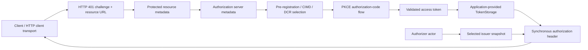
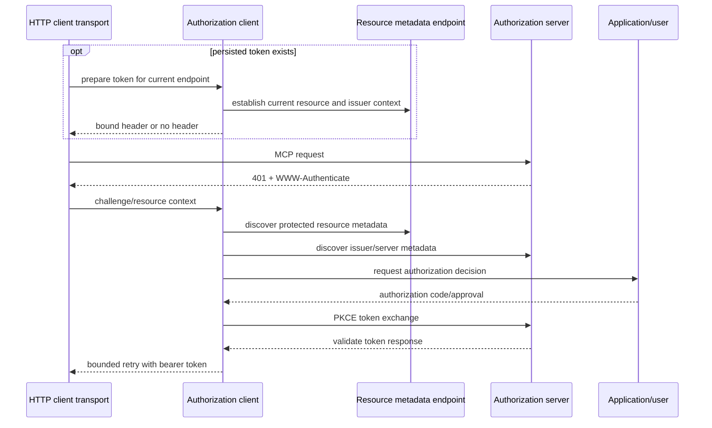

# Authorization Client

## Purpose and Scope

Authorization owns the MCP OAuth client support already grouped under
`Sources/MCP/Base/Authorization`: protected-resource and authorization-server
metadata discovery, issuer and URL validation, PKCE, token exchange, dynamic
client registration, authorization-code flow, bearer challenges, and the
`HTTPClientAuthorizer` contract.

Parent: [Base protocol core](../DESIGN.md).

## Responsibilities and Boundaries

Authorization selects and validates client-side authorization behavior before
an HTTP request is retried. It owns the meaning of issuer/resource binding,
metadata candidates, supported authentication methods, scopes, registration
selection, and token response validation.

It does not implement an authorization server, HTTP transport routing, MCP
method decoding, handler dispatch, user-interface decisions, or the modern
connection/session lifecycle. The application supplies user authorization and
token storage through the existing public contracts.

## Related Designs

| Design | Relationship | Contract used | Cautions |
| --- | --- | --- | --- |
| [Base](../DESIGN.md) | parent | typed values and errors | authorization data is not a substitute for MCP request metadata |
| [Transport](../Transports/DESIGN.md) | used by | `HTTPClientAuthorizer` integration | transport owns request I/O and retry timing |
| [MCP module](../../DESIGN.md) | sibling | public authorization types | preserve additive source compatibility |
| [Client](../../Client/DESIGN.md) | used by | authenticated modern/legacy connection calls | Client owns pending requests and era negotiation |

## Architecture

Discovery and validation are pure policy decisions around network responses;
the URL session and HTTP request body remain owned by the transport/client
integration.

## Contracts and Invariants

| Contract | Guarantee |
| --- | --- |
| Resource binding | Every stored token records the canonical resource/audience for which it was obtained. A persisted token with a missing or different resource is cleared before any MCP request can carry it. |
| Issuer identity | RFC 9207 authorization-response `iss` uses exact string comparison whenever present and is required when advertised; AS metadata from a different issuer is rejected. A persisted token is not emitted until current discovery has established the issuer and it exactly matches the token binding. URL normalization is not applied to issuer identity checks. |
| Discovery order | The client follows the supported pre-registration, CIMD, and DCR selection policy without silently accepting an unvalidated endpoint. |
| Endpoint safety | Redirect, metadata, token, and registration URLs pass the existing URL/security validators before use. |
| Scopes | Supported scopes are selected from challenge/metadata; undefined scopes are omitted, offline access is included only when supported, and step-up scope union is bounded. |
| Token authentication | Basic, post, and none token endpoint authentication use the method advertised by validated metadata; unsupported methods fail explicitly. |
| Retry | The HTTP logical request owns both authorization and scope-upgrade counters. They are bounded by configuration and disappear on every request terminal path; Authorization retains no per-operation retry dictionary. |
| Secret handling | Tokens, client secrets, authorization codes, and PKCE verifiers are not emitted in logs or error descriptions. |
| Ownership | Authorization state is confined to an authorizer/flow and application token storage; it is not copied into a modern MCP connection session. |

## Runtime Flows

## State, Ownership, and Lifecycle

The authorizer actor owns transient challenge, discovery, and credential state.
Application-provided `TokenStorage` is the only token owner and is read at each
use. A small lock-protected snapshot owns only the selected issuer view needed
by the synchronous authorization-header path. A persisted token is prepared by
async discovery before that snapshot can authorize a header. The HTTP logical
request owns retry counters; Authorization retains no state keyed by method or
server-provided scope. Network I/O, callbacks, and token-storage calls remain
outside the snapshot critical section. A failed issuer, resource, endpoint,
scope, or authentication check clears an unusable token and releases transient
state.

## Failure, Concurrency, and Constraints

- All authorization failures remain typed `OAuthAuthorizationError` or the
  existing protocol-facing error; no empty token or unauthenticated success is
  returned after a failed validation.
- Discovery candidates are tried only under the flow's explicit bounded policy;
  the transport's request-local step-up counter stops at the configured limit.
- Concurrent MCP requests share one authorizer through a serialized actor flow;
  dynamic registration, refresh, and challenge handling do not interleave
  across suspension points. `TokenStorage` implementations own
  synchronization required by their public `Sendable` contract.
- Authorization does not inspect or mutate HTTP server exchange state.

## Verification and Change Impact

The focused OAuth suite and the pinned client conformance leg own the 25 scored
`auth/*` entries: metadata variants, CIMD/pre-registration/DCR selection,
exact issuer validation, scope selection and step-up limits, token
endpoint authentication, offline access, migration, and resource mismatch.
Tests must assert failure before token use, including foreign issuer and wrong
resource persisted tokens on the first request, and must inspect logs/errors
for secret leakage. Transport tests own request-local step-up independence.

Changes to issuer/resource binding, endpoint validation, retry limits, scope
selection, or token storage assumptions require rechecking the Transport and
Client designs and the package master.
