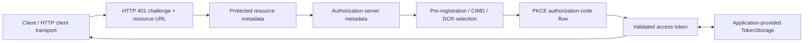
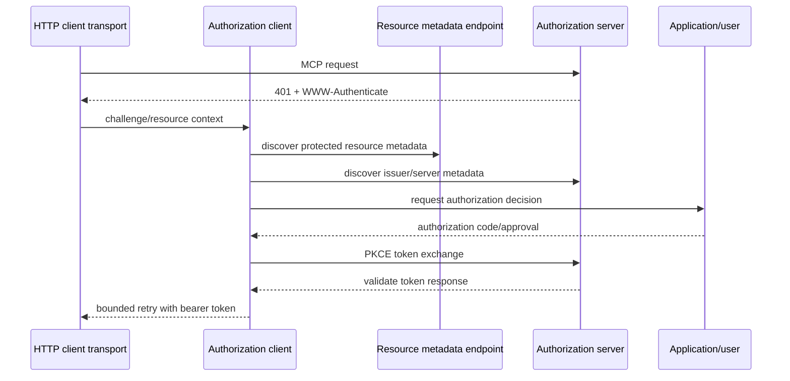

# Authorization Client

## Purpose and Scope

Authorization owns the MCP OAuth client support already grouped under
`Sources/MCP/Base/Authorization`: protected-resource and authorization-server
metadata discovery, issuer and URL validation, PKCE, token exchange, dynamic
client registration, authorization-code flow, bearer challenges, and the
`HTTPClientAuthorizer` contract.

Parent: [Base protocol core](../DESIGN.md).

## Responsibilities and Boundaries

Authorization selects and validates client-side authorization behavior before
an HTTP request is retried. It owns the meaning of issuer/resource binding,
metadata candidates, supported authentication methods, scopes, registration
selection, and token response validation.

It does not implement an authorization server, HTTP transport routing, MCP
method decoding, handler dispatch, user-interface decisions, or the modern
connection/session lifecycle. The application supplies user authorization and
token storage through the existing public contracts.

## Related Designs

| Design | Relationship | Contract used | Cautions |
| --- | --- | --- | --- |
| [Base](../DESIGN.md) | parent | typed values and errors | authorization data is not a substitute for MCP request metadata |
| [Transport](../Transports/DESIGN.md) | used by | `HTTPClientAuthorizer` integration | transport owns request I/O and retry timing |
| [MCP module](../../DESIGN.md) | sibling | public authorization types | preserve additive source compatibility |
| [Client](../../Client/DESIGN.md) | used by | authenticated modern/legacy connection calls | Client owns pending requests and era negotiation |

## Architecture

Discovery and validation are pure policy decisions around network responses;
the URL session and HTTP request body remain owned by the transport/client
integration.

## Contracts and Invariants

| Contract | Guarantee |
| --- | --- |
| Resource binding | Tokens are used only for the protected resource/audience for which they were obtained; resource mismatch fails before token use. |
| Issuer identity | Issuers are normalized and compared consistently; RFC 9207 `iss` is accepted only when supported and expected, and wrong/unexpected/mismatched issuers fail explicitly. |
| Discovery order | The client follows the supported pre-registration, CIMD, and DCR selection policy without silently accepting an unvalidated endpoint. |
| Endpoint safety | Redirect, metadata, token, and registration URLs pass the existing URL/security validators before use. |
| Scopes | Supported scopes are selected from challenge/metadata; undefined scopes are omitted, offline access is included only when supported, and step-up scope union is bounded. |
| Token authentication | Basic, post, and none token endpoint authentication use the method advertised by validated metadata; unsupported methods fail explicitly. |
| Retry | A step-up or bearer challenge may trigger only the bounded retry defined by the flow; repeated challenges do not loop indefinitely. |
| Secret handling | Tokens, client secrets, authorization codes, and PKCE verifiers are not emitted in logs or error descriptions. |
| Ownership | Authorization state is confined to an authorizer/flow and application token storage; it is not copied into a modern MCP connection session. |

## Runtime Flows

## State, Ownership, and Lifecycle

The authorizer owns transient challenge/discovery/flow state until the request
finishes or fails. Long-lived tokens are owned by the application-provided
`TokenStorage`; Authorization never assumes global storage. A failed issuer,
resource, endpoint, scope, or authentication check terminates the flow and
releases transient state.

## Failure, Concurrency, and Constraints

- All authorization failures remain typed `OAuthAuthorizationError` or the
  existing protocol-facing error; no empty token or unauthenticated success is
  returned after a failed validation.
- Discovery candidates are tried only under the flow's explicit bounded policy;
  step-up retries stop at the configured retry limit.
- Concurrent MCP requests may share an application authorizer only through its
  documented `Sendable`/storage contract; mutable token storage must provide its
  own synchronization.
- Authorization does not inspect or mutate HTTP server exchange state.

## Verification and Change Impact

The focused OAuth suite and the pinned client conformance leg own the 25 scored
`auth/*` entries: metadata variants, CIMD/pre-registration/DCR selection,
issuer validation and normalization, scope selection and step-up limits, token
endpoint authentication, offline access, migration, and resource mismatch.
Tests must assert failure before token use and must inspect logs/errors for
secret leakage.

Changes to issuer/resource binding, endpoint validation, retry limits, scope
selection, or token storage assumptions require rechecking the Transport and
Client designs and the package master.
