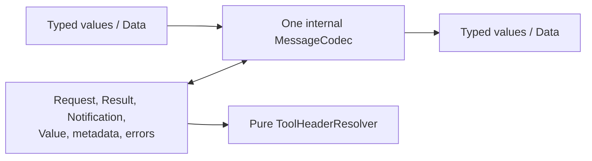
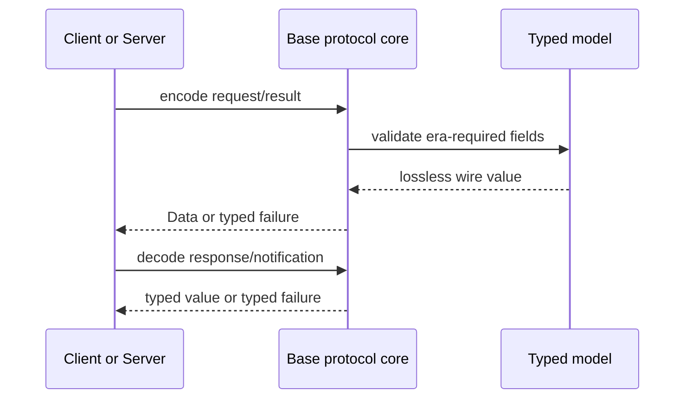

# Base Protocol Core

## Purpose and Scope

Base owns the shared, state-free protocol vocabulary used by the `MCP` module:
JSON-RPC request/response/notification values, `Value`, IDs, typed MCP errors,
version and lifecycle models, and the internal modern codec and tool-header
resolver introduced by this work.

Parent: [MCP module](../DESIGN.md).

Related child components:

- [Transport](Transports/DESIGN.md)
- [Authorization](Authorization/DESIGN.md)
- [Utilities](Utilities) (existing source grouping; no separate design unit)

## Responsibilities and Boundaries

Base generates and consumes protocol values; it does not open connections,
dispatch handlers, retain pending requests, or ask users for input. The codec is
one concrete internal implementation, not a protocol hierarchy or factory.
`ToolHeaderResolver` is a pure schema/value operation and does not perform
network `$ref` resolution.

Base does not own the HTTP `ExchangeID`, connection negotiation state, OAuth
credential lifecycle, application persistence, or Tasks.

## Related Designs

| Design | Relationship | Contract used | Cautions |
| --- | --- | --- | --- |
| [MCP module](../DESIGN.md) | parent | module public surface and dependency direction | keep the core independent of transport implementations |
| [Transport](Transports/DESIGN.md) | sibling/used by orchestration | raw bytes and exchange delivery | Base supplies payloads; Transport supplies delivery |
| [Authorization](Authorization/DESIGN.md) | child/sibling protocol support | typed OAuth data and validation errors | OAuth HTTP calls remain outside the codec |
| [Client](../Client/DESIGN.md) | used by | request metadata, result metadata, and header derivation | Client owns retry and pending state |
| [Server](../Server/DESIGN.md) | used by | request validation, MRTR results, and discovery models | Server owns dispatch and semantic state |

## Architecture

The codec is the sole owner of era-specific wire representation. Existing
legacy representations remain lossless. Modern fields are validated and
encoded by the same concrete codec rather than by separate legacy and modern
model trees.

## Contracts and Invariants

| Contract | Guarantee |
| --- | --- |
| JSON-RPC compatibility | Existing legacy request, response, notification, and arbitrary `Value` payloads remain decodable and encodable without semantic loss. |
| Era-aware wire rules | Supported legacy-family behavior (`2024-11-05` through `2025-11-25`) remains tolerant where the existing API requires it; `2026-07-28` requires request `_meta`, defaults an absent response `resultType` to `complete`, and requires an explicit `input_required` value for MRTR. |
| Metadata | Modern request metadata contains required protocol version and client capability fields; optional client info and extension fields remain distinguishable. Result cache hints and opaque request state are preserved as values. |
| MRTR values | Input-required results distinguish complete from input-required state, preserve opaque `requestState`, and carry keyed input requests/responses without inventing application decisions. `InputResponse` stores only its raw wire value; the caller supplies the originating method to `validate(for:)`, because the open union may be ambiguous when extension fields are present. |
| Subscription values | Subscription filters, acknowledgement metadata, and terminal results are represented as protocol data; stream ownership remains in orchestration/transport. |
| Header derivation | The resolver uses an iterative worklist over the finite acyclic caller-owned `Value`; only statically reachable `properties` produce bindings. Non-properties branches are inspected for forbidden annotations. Work is O(schema nodes), temporary storage is O(schema depth), and immutable bindings live for one operation. Invalid or duplicate `x-mcp-header` annotations exclude the tool; null/missing values are omitted; string/integer/boolean values use the specified safe encoding. |
| Schema boundary | Tool-header schema walks are finite and local to the caller-owned acyclic `Value`; no arbitrary node-count threshold is imposed, no network `$ref` is dereferenced, and Base owns traversal complexity but no pagination. Client owns paginated discovery through `maxToolListPages = 64`; Server separately owns request-local current-authorization tool-schema lookup through `maxToolSchemaLookupPages = 64`. |
| Failure | Missing required request metadata, invalid explicit modern fields, mismatched versions, unsupported capabilities, invalid header annotations, and missing resources produce typed failures rather than empty success. `ResourceNotFound` uses `-32602` and preserves the requested URI in error data. An absent response `resultType` is the specified `complete` default, not a failure. A finite schema walk terminates without an arbitrary size rejection; malformed or unsupported values remain failures, and network `$ref` targets are never fetched. Client and Server report their own pagination-bound and cursor-cycle failures. |

`ConnectionInfo`, `ProtocolEra`, and typed modern failure values are internal or
public only at the API boundary where the module design requires them. Their
ownership and exposure are defined by the Client design; Base only defines
their wire meaning.

## Runtime Flows

Header derivation is an iterative, finite, pure operation over one caller-owned
tool schema and one argument value. It performs O(schema nodes) work with
O(schema depth) temporary traversal storage and retains immutable bindings only
for that operation. It has no I/O and cannot mutate the tool registry or a
connection.

## State, Ownership, and Lifecycle

The codec and resolver retain no cross-request mutable state. A caller owns the
input and result values for the operation. Resolver worklists and immutable
bindings live only for one operation. Opaque request state is copied as a
protocol value only for the request lifetime; it is not used as a server-side
session key by Base.

## Failure, Concurrency, and Constraints

- Base values are `Sendable` where the public module contract requires it; no
  shared mutable registry is introduced.
- A result without `resultType` is interpreted as `complete` in every supported
  era. Input-required results must carry the explicit `input_required` value.
- Resolver traversal uses an iterative worklist over a finite acyclic
  caller-owned `Value`, performs O(schema nodes) work with O(schema depth)
  temporary storage, has no arbitrary schema-node rejection threshold, and
  never dereferences a network `$ref`.
- Client owns paginated tool discovery, with positive `maxToolListPages` default
  `64`; cursor cycles and page-bound exhaustion are failures, not infinite loops.
- Server independently owns request-local tool-schema lookup pagination, with
  positive `maxToolSchemaLookupPages` default `64`; Base retains no page or
  cursor state for either operation.
- Unknown extension fields are preserved where the existing `Value`/metadata
  contract permits, while malformed required fields fail decoding.

## Verification and Change Impact

Focused protocol-core tests must prove legacy wire fixtures, modern required
fields, MRTR/subscription round trips, invalid result/input combinations,
header annotation validation, safe value encoding, finite deep-schema success
without an arbitrary size threshold, and the network-ref no-dereference rule.
These tests own Base invariants; Client and Server integration tests must not
replace them.

Changes to wire fields, error codes, metadata requirements, schema traversal, or
the traversal complexity contract require rechecking the module master and
Client, Server, and Transport designs.
