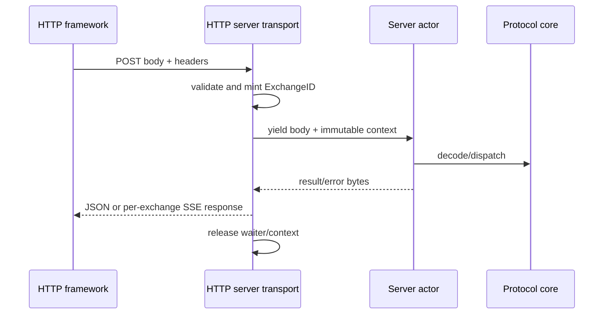
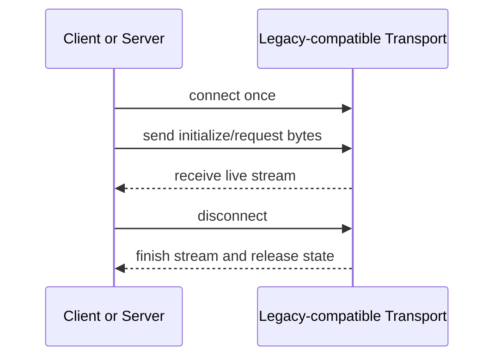

# Transport Layer

## Purpose and Scope

Transport owns byte delivery and connection lifetime for the public `MCP`
module. It includes the existing `Transport` actor contract, in-memory, stdio,
network, HTTP client, and HTTP server mechanics. The HTTP server mechanics are
kept in the existing `HTTPServer` source directory; no new component directory
is introduced.

Parent: [Base protocol core](../DESIGN.md).

## Responsibilities and Boundaries

Transport creates, validates, routes, and tears down delivery channels. Its
protocol responsibility is limited to standard protocol headers, Origin,
per-POST `ExchangeID`, raw delivery, and HTTP status mapping. For modern
stateless HTTP it owns the immutable request headers/body and opaque request
context, response waiter, cancellation, and terminal cleanup. It also owns
legacy HTTP session/SSE mechanics where the peer is legacy.

Transport does not decode MCP method semantics, invoke `Client`/`Server`
handlers, decide application input, persist sessions, or implement OAuth
policy. It may invoke the Authorization child through the existing client
authorizer contract, but credential selection remains an Authorization concern.
It does not inspect tool schemas, validate schema-derived `Mcp-Param-*` values,
or decide whether a method is known. Server performs those semantic checks with
the current request/auth context and Base's `ToolHeaderResolver` before handler
dispatch.
For outbound modern HTTP, Transport accepts Client-derived headers through a
Client-only package capability and applies them to one request. It never
derives or interprets their method or schema meaning.
Before forwarding inbound data, it validates every modern JSON-RPC response
against the ID of the POST that produced it. A malformed or mismatched response
fails only that POST and cannot complete or cancel another pending request.

## Related Designs

| Design | Relationship | Contract used | Cautions |
| --- | --- | --- | --- |
| [Base](../DESIGN.md) | parent/depends on | payload models and typed protocol failures | transport must not move protocol semantics into routing |
| [MCP module](../../DESIGN.md) | sibling/used by | public `Transport` API | preserve the raw actor contract exactly |
| [Client](../../Client/DESIGN.md) | used by | connection and request delivery | Client must not downcast to a concrete transport |
| [Server](../../Server/DESIGN.md) | used by | incoming data and request context lookup | Server receives normalized context, not HTTP implementation details |
| [Authorization](../Authorization/DESIGN.md) | depends on | HTTP client authorizer and token policy | transport does not own issuer or scope decisions |

## Architecture

```mermaid
flowchart TD
    Caller[Client or Server actor]
    Raw[Public Transport actor<br/>connect / disconnect / send(Data) / receive()]
    Stdio[Stdio / in-memory / network framing]
    HTTPClient[HTTP client mechanics]
    HTTPServer[HTTP server mechanics<br/>request validation and response routing]
    Exchange[ExchangeID<br/>per modern HTTP POST]
    Wire[HTTP framework adapter]

    Caller --> Raw
    Raw --> Stdio
    Raw --> HTTPClient
    Raw --> HTTPServer
    HTTPServer --> Exchange
    HTTPServer --> Wire
```

The public raw API remains the narrow seam. Modern exchange metadata is an
internal transport concern and is not smuggled into JSON-RPC `ID` or the public
`Transport` method signatures.

### Package-internal exchange capability seam

The modern HTTP path adds exactly one package-internal capability to the
existing public `Transport` contract. It is one exchange-aware refinement, not
a hierarchy of transport protocols and not a factory:

| Direction | Internal envelope | Owner and condition |
| --- | --- | --- |
| HTTP adapter to orchestration | `ExchangeEnvelope` containing `ExchangeID`, immutable request body, standard headers, and opaque raw request context | HTTP transport creates it only after a modern POST passes standard header and Origin checks; Server normalizes and interprets request/auth context |
| orchestration to HTTP adapter | `ExchangeEvent` containing the same `ExchangeID` and a JSON response, an SSE event, or a terminal failure | Server emits it only for the admitted exchange; the transport rejects a different or already-terminated ID |
| cancellation | the admitted `ExchangeID` | HTTP disconnect/cancel targets that exchange only and never searches by JSON-RPC `ID` |

The capability's input is an admitted modern HTTP exchange; its output is
exchange-keyed response events until one terminal event. The public
`Transport.send(Data)`/`receive()` path remains the fallback for existing raw
custom transports and legacy-compatible stdio. A raw custom transport that does
not provide the package capability is never treated as modern HTTP exchange
delivery: an explicit modern HTTP operation fails with a typed unsupported
capability error, while the existing legacy entry point continues unchanged.
Modern stdio may use the raw live channel because it has no HTTP exchange
identity; it still follows the Client negotiation contract and one-connection
fallback rule.

### Package-internal client HTTP request capability

`HTTPRequestSendingTransport` is the outbound seam for Client-owned modern
headers. It adds `send(Data, headers:)` and negotiated-version update without
changing public `Transport`. Client selects it only for explicit HTTP delivery;
a nonconforming transport fails before send. Byte-stream delivery continues to
use `Transport.send(Data)`.

## Contracts and Invariants

| Contract | Guarantee |
| --- | --- |
| Public raw transport | `Transport: Actor` retains `logger`, `connect()`, `disconnect()`, `send(Data)`, and `receive() -> AsyncThrowingStream<Data, Error>`. Existing custom transports continue to compile and behave as raw byte channels. |
| Client HTTP request capability | The package-internal HTTP capability applies Client-derived headers to one request, updates the selected protocol-version header, and validates direct or SSE response IDs against that request before forwarding. It owns HTTP construction/auth/retry/SSE only and never inspects method or schema meaning. |
| Authorization retry ownership | Each HTTP logical request owns finite authorization and scope-upgrade counters. The counters are released by stack lifetime on success, failure, or cancellation and never persist in the authorizer or across later requests. |
| Modern HTTP admission | Each request is a new POST. The transport validates HTTP/body syntax, safely normalizes standard header names and OWS, validates the protocol-version header and its exact agreement with request `_meta` before Base decoding, preserves the request ID and structured error data on admission failure, validates Origin, mints an `ExchangeID`, and maps typed boundary failures to HTTP status. Server owns method/name header applicability, tool-schema custom-header, and method-semantic validation. |
| Modern HTTP lifecycle | No modern session ID, GET subscription endpoint, `Last-Event-ID`, replay, or DELETE lifecycle is used. A per-request JSON or SSE result ends with that exchange. |
| Legacy HTTP compatibility | Existing stateful initialize/session/GET-SSE/DELETE/replay paths remain available for legacy peers and are not selected for modern requests. |
| Exchange identity | `ExchangeID` is unique for the lifetime of one admitted POST and is independent of the JSON-RPC `ID`. Equal JSON-RPC IDs in concurrent POSTs cannot share a waiter, context, response, notification, or cancellation. |
| Context | Raw HTTP headers/body/path/auth context is carried immutably for delivery. Transport canonicalizes standard header names and safe OWS; Server combines the request/auth context with the tool schema and Base resolver for semantic and custom-header validation. |
| Modern SSE delivery | Each exchange retains at most the current event and one pending event. A terminal event may occupy the pending slot without waiting for the consumer, so shutdown is bounded while delivery order remains acknowledgement/notification before terminal. |
| Cleanup | Validation failure, response, handler failure, cancellation, disconnect, and shutdown release every exchange waiter and context exactly once. |
| Stdio | Modern discovery/fallback uses one live connection and one receive stream; it never opens a probe connection and then a second operational connection. |
| Concurrency | Transport actor isolation serializes routing maps; independent exchanges may progress concurrently without JSON-RPC-ID collisions. |

## Runtime Flows

### Modern HTTP



### Legacy raw transport



## State, Ownership, and Lifecycle

| State | Owner | Lifetime |
| --- | --- | --- |
| connected/disconnected flag | concrete transport actor | `connect` through `disconnect` |
| legacy HTTP session/SSE state | legacy HTTP transport | peer's legacy session lifetime |
| modern exchange record | HTTP server transport | POST admission through terminal response/cancel/disconnect |
| incoming stream continuation | concrete transport | connect through disconnect/shutdown |
| authorizer reference | HTTP client transport | transport lifetime; OAuth state remains in Authorization/TokenStorage |
| authorization retry counters | current HTTP logical request | first send through success, failure, or cancellation; no cross-request retention |

The exchange record is not a server session and is not retained after terminal
cleanup. Notifications or server-initiated requests that have no valid modern
delivery channel fail or follow the transport's explicit legacy behavior; they
are not silently delivered to another exchange.

## Failure, Concurrency, and Constraints

- HTTP validation runs before the body enters server dispatch. Unsafe standard
  header values and unsupported versions fail before delivery; unsupported
  versions are `400` with typed `UnsupportedProtocolVersion`, original request
  ID, and `requested`/`supported` data. A protocol-version header/body mismatch
  is `400` with `HeaderMismatch`, and invalid Origin is `403`. Server's typed header mismatch is mapped to modern HTTP
  `400` with `-32020`, and its typed method-not-found result is mapped to
  modern HTTP `404` with `-32601`; Transport does not decide method semantics.
- A cancelled or disconnected exchange resumes its waiter with a typed failure,
  removes its context, and ignores a late response.
- A malformed modern response or an ID that differs from the originating POST
  fails that request's delivery task before global message delivery. Other
  in-flight requests remain pending and cannot consume that response.
- Modern SSE is per request and non-resumable. Legacy resumability remains only
  on the legacy branch. Non-terminal producers apply bounded backpressure;
  terminal delivery never makes shutdown wait for an inactive consumer.
- Transport does not perform unbounded response buffering, cursor traversal, or
  schema walking. Higher-layer limits are enforced by their owners.
- Authentication retries and `403 insufficient_scope` upgrades are bounded by
  request-local counters. A later request starts with fresh counters even when
  its JSON-RPC method and challenged scope equal an earlier request.

## Verification and Change Impact

Focused transport tests must cover raw custom `Transport` compatibility, one
live stdio fallback, independent stateless HTTP POSTs, standard header and
Origin/DNS-rebinding rejection, exchange-keyed JSON/SSE response routing,
identical JSON-RPC IDs, cancellation, disconnect, terminal cleanup, and the
typed fallback when an HTTP transport lacks the exchange capability. Custom
header derivation/validation and unknown-method behavior are verified by the
Client/Server owners. Existing legacy HTTP and network tests remain a separate
regression class.

Changes to exchange identity, HTTP status/error mapping, authorization retry
lifetime, stream lifecycle, or raw method signatures require rechecking Base,
Client, Server, Authorization, and the package master.
