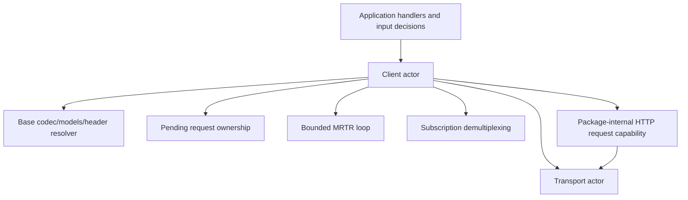
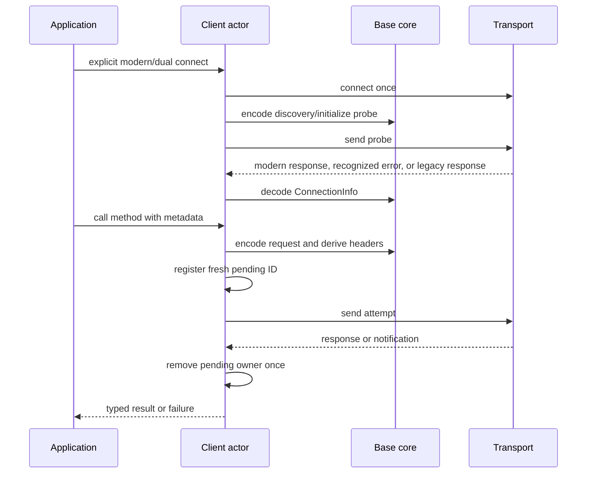
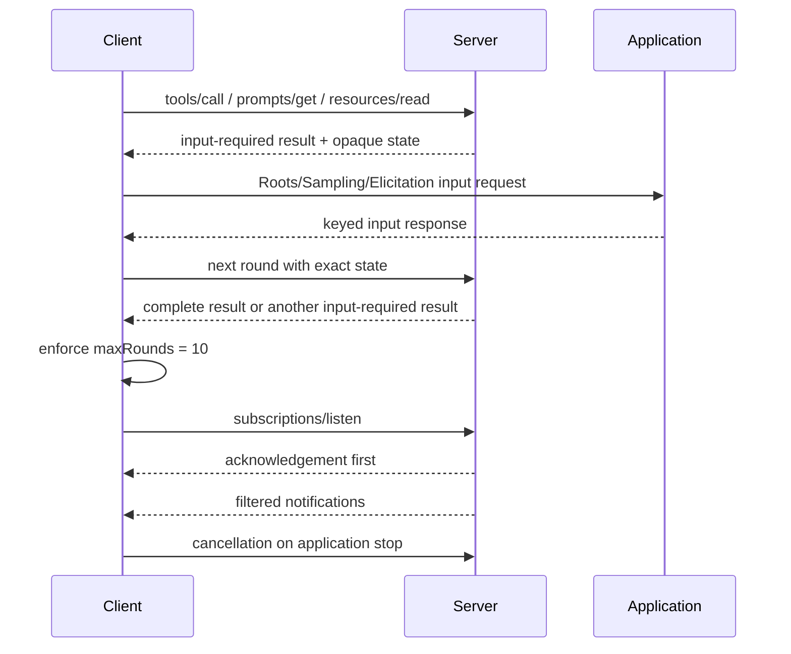

# Client Orchestration

## Purpose and Scope

The `Client` actor owns client-side MCP orchestration: transport connection
lifetime as seen by the public API, legacy initialize compatibility, explicit
modern/dual-era negotiation, pending request completion, handler registration,
modern request metadata, tool-header retry, MRTR coordination, and modern
subscription demultiplexing.

Parent: [MCP module](../DESIGN.md).

## Responsibilities and Boundaries

Client creates protocol requests, registers one pending owner per request ID,
drives the response loop, and exposes typed results and failures. It selects
the era through an explicit connection API and returns `ConnectionInfo` for
modern/dual-era use. That API also receives an explicit byte-stream or HTTP
delivery kind because the unchanged public `Transport` contract cannot infer
the external adapter's wire semantics.

Client does not encode wire details itself, inspect a concrete transport type,
perform HTTP header parsing, resolve schemas over the network, own server
handlers, persist user input, or implement Tasks. Roots, Sampling, and
Elicitation are application-provided handlers; Client transports their
decisions through the protocol.

## Related Designs

| Design | Relationship | Contract used | Cautions |
| --- | --- | --- | --- |
| [MCP module](../DESIGN.md) | parent | public actor API and direction | additive modern API must not reinterpret legacy calls |
| [Base](../Base/DESIGN.md) | depends on | codec, typed models/errors, metadata, and header resolver | Client owns orchestration around those values |
| [Transport](../Base/Transports/DESIGN.md) | depends on | raw transport and modern exchange delivery | no concrete transport downcast |
| [Authorization](../Base/Authorization/DESIGN.md) | used through transport | authorizer/token policy | Client does not duplicate OAuth logic |
| [Server](../Server/DESIGN.md) | peer | discovery, MRTR, subscriptions, and result contracts | request-scoped modern state is not a Client session |

## Architecture

There is one orchestration actor, not a coordinator/factory layer. Core and
transport remain replaceable behind their existing contracts without exposing
their internal state to callers.

## Contracts and Invariants

| Contract | Guarantee |
| --- | --- |
| Legacy entry point | For the supported legacy family (`2024-11-05` through `2025-11-25`), `connect(transport:) async throws -> Initialize.Result` keeps its existing initialize/initialized behavior and accepts existing raw `Transport` implementations. |
| Modern entry point | An explicit modern/dual-era operation returns `ConnectionInfo`; it reports negotiated era, supported capabilities, and server information without exposing a transport-specific type. |
| Delivery selection | `.byteStream` uses the unchanged raw transport. `.http` requires the package-internal HTTP request capability and fails before sending when the transport does not provide it; there is no silent raw fallback. |
| Connection preference | `.modernOnly` accepts only successful modern discovery. When `-32022` advertises the requested modern version, Client retries discovery once with a fresh request ID. `.modernThenLegacy` falls back on the same byte-stream connection only after a non-modern JSON-RPC error or discovery timeout; other recognized modern errors and a failed version retry remain modern failures, and malformed/closed streams never fall back. |
| Connection ownership | Client owns at most one active transport/message-loop pair. A second `connect` before `disconnect` fails without connecting or replacing the proposed transport. |
| Discovery timeout | `Client.Configuration.discoveryProbeTimeout` is finite and positive, defaults to the existing 10-second initialization wait baseline, and bounds only the discovery classification attempt. |
| Negotiation | Stdio probes modern discovery and recognized modern errors on one live connection before legacy fallback; HTTP pins the origin's selected era for the configured origin lifetime, ending only when the origin configuration changes or an explicit disconnect/other defined terminal condition occurs. A supported-version rejection permits one fresh-ID discovery retry; unsupported versions and closed/malformed streams fail explicitly. |
| Pending requests | Each attempt registers a fresh JSON-RPC ID before send; response, send failure, local cancellation, remote cancellation, disconnect, and malformed stream remove/resume the pending owner exactly once. |
| Metadata | Every modern request carries request-scoped `_meta` with required protocol/client capability fields; absent response `resultType` defaults to `complete`, explicit result types and cache hints are decoded and exposed as data, with no cache store. |
| Tool headers | For HTTP `tools/call`, Client asks the Base resolver for headers from the current tool schema, omits null/missing values, rejects invalid tools, and retries a `-32020` mismatch at most once with a fresh request ID. Byte-stream delivery does not perform HTTP-only schema discovery. |
| MRTR | Client accepts only the supported input requests for `tools/call`, `prompts/get`, and `resources/read`, routes each key to the application handler, preserves the opaque untrusted `requestState` exactly, and owns the `maxRounds = 10` loop. Integrity policy is application/conformance policy, not Client state validation. |
| Subscriptions | Client demultiplexes acknowledged modern subscription streams, requires acknowledgement ordering, and cancels/cleans each stream without treating a subscription as a connection session. |
| Application ownership | User input, approval, persistence, and task scheduling remain outside Client. |

### Stdio negotiation decision

Modern discovery and legacy fallback share one already-connected stdio channel.
The result of the first probe selects the behavior below:

| Probe outcome | Decision | Connection rule |
| --- | --- | --- |
| `DiscoverResult` | Pin modern for the live connection | continue on the same connection |
| `-32022` advertising the requested modern version | Retry discovery once with a fresh request ID | continue on the same connection |
| Other recognized modern protocol error, or failed version retry | Pin modern and surface the typed modern error | continue on the same connection |
| Other JSON-RPC error, including `-32601` or `-32602` | Fall back to legacy initialize | send initialize on the same live connection |
| Probe timeout | Fall back to legacy initialize | send initialize on the same live connection |
| Stream or process closed | Return typed negotiation/transport failure | do not open a second probe or operational connection |

An arbitrary malformed response is not a successful fallback; it is a typed
negotiation failure unless the codec can classify it as one of the explicit
legacy fallback outcomes above.

## Runtime Flows

### Connection and request

### MRTR and subscription

## State, Ownership, and Lifecycle

| State | Owner | Lifetime |
| --- | --- | --- |
| active raw connection | Client actor reference + abstract Transport actor | explicit connect through disconnect |
| selected delivery kind | Client actor | explicit modern/dual connect through disconnect; it determines raw versus HTTP request delivery without identifying a concrete transport |
| negotiated `ConnectionInfo` | Client actor | configured origin lifetime, ending on origin configuration change or explicit disconnect/defined terminal condition; modern HTTP request metadata is not stored as session state |
| discovery timer | current Client negotiation attempt | one discovery send through its classified response, timeout, cancellation, or disconnect; at most two sequential attempts and no retained timer afterward |
| pending request table | Client actor | request registration through one terminal outcome |
| outbound delivery task | Client actor request/subscription state | send start through response, send failure, local/remote cancellation, disconnect, malformed input, or subscription terminal outcome; local cancellation does not depend on peer cooperation |
| tool header list | one modern HTTP call attempt | transient discovery operation; cursor pages stop at 64 |
| MRTR request state | Client request orchestration | current call flow; exact opaque untrusted value is echoed and released on completion/failure |
| subscription stream | Client actor | listen admission through cancellation/terminal result/disconnect |

## Failure, Concurrency, and Constraints

- Client actor methods serialize mutations to connection, pending, handler, and
  subscription state. I/O and application callbacks are awaited outside any
  state critical section.
- A response for an unknown or already-cancelled ID is ignored as a late
  response, not delivered to another request.
- Modern negotiation distinguishes a recognized modern error from an invalid
  or legacy response; only the specified fallback path may continue on the same
  live stdio connection.
- A `-32022` response retries only when its supported-version list contains the
  requested modern version. The retry uses a fresh request ID and is bounded to
  one; its failure is surfaced without another retry or legacy fallback.
- Tool discovery is bounded by the positive `maxToolListPages` default `64`;
  focused tests prove page-bound and cursor-cycle failures, and malformed pages
  are typed failures.
- Client's MRTR loop is bounded by positive `maxRounds` default `10`; missing/
  extra input, unsupported method/capability, malformed protocol shape, and
  incomplete terminal values fail explicitly. Client does not classify an
  opaque request-state value as tampered; integrity policy belongs to the
  application/conformance fixture.

## Verification and Change Impact

Client-focused tests own explicit modern/legacy negotiation, fresh-ID bounded
supported-version retry, same-connection stdio fallback, malformed/unsupported responses, pending cleanup, per-request
metadata, cache-hint exposure, tool-header filtering/retry, page-bound and
cursor-cycle failure, MRTR rounds and
exact opaque state echo, subscription acknowledgement/filter/cancellation, and
colliding IDs. Application/conformance fixtures own any tampered-state policy.
Client conformance also owns the 32 frozen client IDs in composition with the
Authorization and Transport contracts.

Changes to connection APIs, pending ownership, retry/round bounds, request
metadata, or subscription lifecycle require rechecking Base, Transport, Server,
and the package master.
