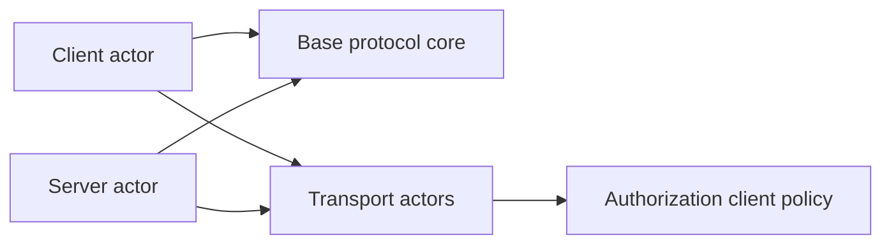
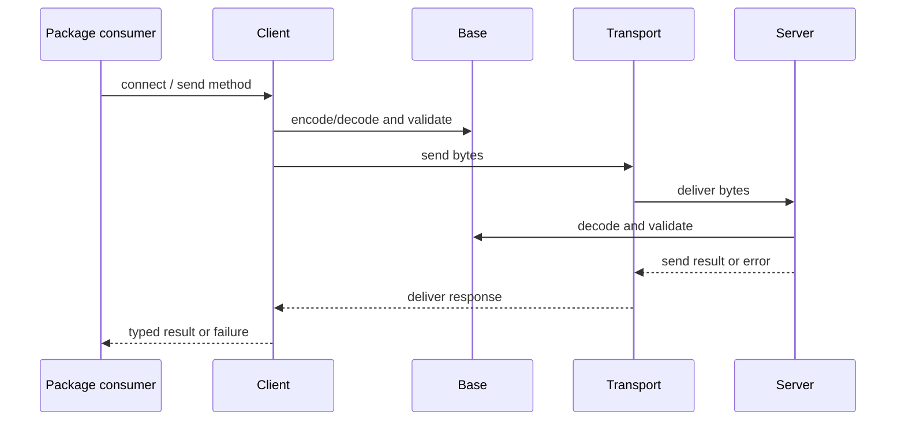

# MCP Module

## Purpose and Scope

This document is the module design for the single SwiftPM target `MCP`.
It composes the public client/server actors, shared protocol values, transport
actors, and OAuth client support without introducing another package or module.

Parent: [repository/package master](../../DESIGN.md).

Children:

- [Base protocol core](Base/DESIGN.md)
- [Client](Client/DESIGN.md)
- [Server](Server/DESIGN.md)

## Responsibilities and Boundaries

The module owns the public Swift API surface and composes the child contracts.
`Client` and `Server` are the only orchestration owners. Base owns state-free
protocol values and wire rules. Transport owns byte movement and HTTP/stdio
lifetimes. Authorization owns client-side OAuth policy.

The module does not own application input, UI, persistence, an authorization
server, a conformance protocol fork, or the Tasks extension. It does not split
the current package into feature packages merely to represent design layers.

## Related Designs

| Design | Relationship | Contract used | Cautions |
| --- | --- | --- | --- |
| [Package master](../../DESIGN.md) | parent | global era, limit, and compatibility invariants | changes to public composition require parent review |
| [Base](Base/DESIGN.md) | child/depends on | state-free messages, models, and typed errors | no connection or I/O state |
| [Transport](Base/Transports/DESIGN.md) | related design through Base | `Transport` actor and exchange mechanics | raw send/receive remains source-compatible |
| [Authorization](Base/Authorization/DESIGN.md) | related design through Base | OAuth discovery and credential policy | HTTP transport invokes policy through its public contract |
| [Client](Client/DESIGN.md) | direct child/owns orchestration | explicit modern connection and legacy `connect` | no concrete transport knowledge |
| [Server](Server/DESIGN.md) | direct child/owns orchestration | dispatch, discovery, and semantic request state | no HTTP header parsing |

## Architecture

The arrows describe use of contracts, not a runtime call from every type. Base
is below orchestration and does not import transport mechanics. Transport does
not dispatch method handlers. Authorization does not own a connection or
persist application credentials.

## Contracts and Invariants

| Module contract | Guarantee |
| --- | --- |
| Public API compatibility | Existing `connect(transport:) -> Initialize.Result`, `Transport.send(Data)`, `Transport.receive()`, and legacy method models remain available and behavior-compatible. |
| Explicit modern boundary | Modern/dual-era connection returns `ConnectionInfo`; legacy entry points do not silently change era semantics. |
| State ownership | Actor state belongs to `Client` or `Server`; transport state belongs to a transport actor; protocol values and codec are state-free. |
| Error visibility | Invalid wire data, unsupported versions/capabilities, cancellation, disconnect, and resource-bound exhaustion remain observable typed failures. |
| Direction | Client/Server may depend on Base and Transport contracts; Base never depends on Client, Server, or transport implementations. |
| Extension scope | Roots, Sampling, Logging, DCR, and other valid 2026 contracts remain represented where applicable; Tasks is not implemented in this work. |

## Runtime Flows

Modern HTTP adds an exchange lifetime inside Transport; it does not turn the
module into a session manager. MRTR and application decisions remain in the
Client/Server orchestration contracts.

## State, Ownership, and Lifecycle

The module has no global mutable protocol registry. `Client` and `Server` actors
own their own handlers, pending operations, and negotiated legacy state. A
modern stateless HTTP exchange is owned by the HTTP transport until terminal
response or cancellation. Child designs define the exact state fields and
cleanup rules.

## Failure, Concurrency, and Constraints

- Actor isolation serializes mutable orchestration state; no new global lock or
  coordinator is introduced.
- One JSON-RPC request ID is not used as an HTTP exchange identity.
- The fixed positive defaults are `maxRounds = 10`, `maxToolListPages = 64`,
  `maxToolSchemaLookupPages = 64`, and `maxSubscriptions = 1024`; Client owns
  the first two limits and Server owns the latter two.
- New code reports failure explicitly and does not use empty success values as a
  fallback for malformed or unsupported modern messages.

## Verification and Change Impact

The module is verified compositionally: Base and transport focused tests prove
their contracts first, then Client/Server integration proves their interaction,
and the pinned conformance executables prove the public path. The original
legacy test baseline remains a separate evidence class.

Any child change to a public type, era rule, state owner, lifetime, error, or
limit requires rechecking this module document and the package master. A file
move alone is not a reason to add a module or package.
