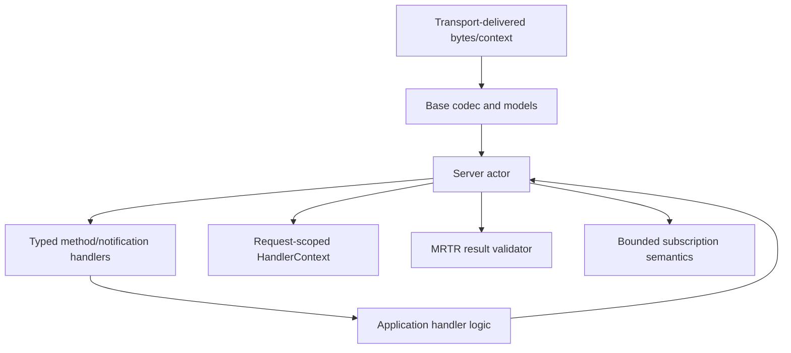
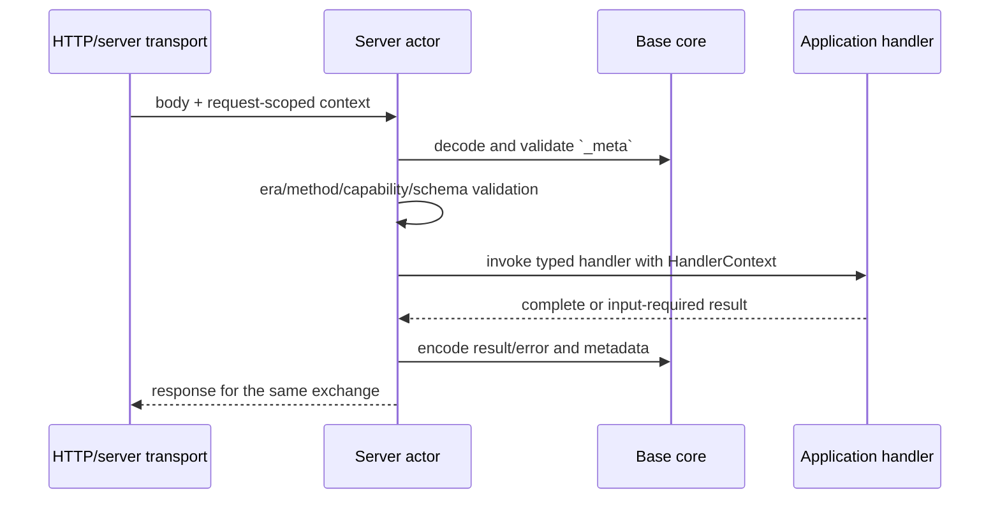
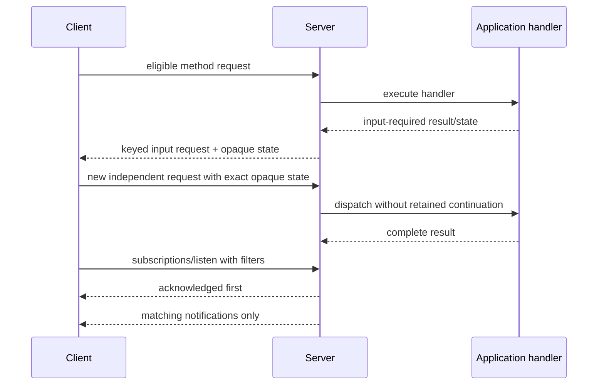

# Server Orchestration

## Purpose and Scope

The `Server` actor owns server-side MCP orchestration: handler registration,
legacy initialize state, modern `server/discover`, normalized request context,
method and capability validation, handler task cancellation, MRTR validation,
result metadata, and bounded semantic subscriptions.

Parent: [MCP module](../DESIGN.md).

## Responsibilities and Boundaries

Server maps decoded method names to typed handlers, creates an independent
request-scoped context for every POST/request, invokes application handlers, and
returns typed success or failure results. It owns the semantic meaning of modern
request metadata, input-required results, capability gates, custom tool-header
and method validation, and subscription acknowledgement/filter state.

Server does not parse standard HTTP headers, mint HTTP exchange IDs, frame bytes,
own client UI/input, implement OAuth, persist application data, or implement
Tasks. Transport supplies normalized delivery/context and status mapping; Base
supplies wire values and typed errors. For an incoming modern tool call, Server
uses the current request/auth context, the relevant tool schema, and Base's
`ToolHeaderResolver` to validate `Mcp-Param-*` values and method semantics before
invoking the handler.

## Related Designs

| Design | Relationship | Contract used | Cautions |
| --- | --- | --- | --- |
| [MCP module](../DESIGN.md) | parent | public `Server` actor and module direction | preserve legacy `start`/`stop` behavior |
| [Base](../Base/DESIGN.md) | depends on | request/result models, metadata, errors, and codec | Server does not reimplement decoding |
| [Transport](../Base/Transports/DESIGN.md) | depends on | raw delivery and normalized HTTP context | no transport-specific routing map in Server |
| [Client](../Client/DESIGN.md) | peer | Roots/Sampling/Elicitation handlers and MRTR responses | application decisions stay on Client side |
| [Authorization](../Base/Authorization/DESIGN.md) | boundary peer | client-side OAuth only | Server does not become an authorization server |

## Architecture

The transport context is data supplied to Server; Server never reaches into a
concrete HTTP transport. Legacy connection state and modern request state are
separate branches of one actor contract.

## Contracts and Invariants

| Contract | Guarantee |
| --- | --- |
| Legacy lifecycle | Existing `start(transport:)`, initialize/initialized ordering, strict capability checks, cancellation, and `stop()` behavior remain available for legacy peers. |
| Modern discovery | `server/discover` is always implemented for modern requests and returns supported versions, capabilities, and server metadata through the Base result contract. |
| Request context | Each handler sees immutable request-scoped metadata and normalized HTTP context, if supplied; context is released after dispatch. |
| Custom headers and method semantics | Server combines the current request/auth context with the relevant tool schema and Base's `ToolHeaderResolver` to validate schema-derived `Mcp-Param-*` values and method semantics before handler dispatch; Transport only forwards the headers and maps the typed outcome to HTTP status. |
| Tool-schema lookup | For each modern `tools/call`, Server invokes the registered `tools/list` handler in the current authorization context and follows cursors until the named tool is found or pagination terminates. `Server.Configuration.maxToolSchemaLookupPages` is positive and defaults to `64`; seen cursors are bounded by that limit, cycles and exhaustion are typed failures, and pages, cursors, and schemas are not cached or retained across requests. |
| Era gates | Modern removed operations return explicit method-not-found behavior; valid Roots, Sampling, Logging, and DCR-related contracts are not removed by an era shortcut. |
| Capability validation | A method requiring an undeclared client capability returns typed `MissingRequiredClientCapability`; validation happens before application handler invocation. |
| Result contract | Modern results carry required `resultType`; cache hints and opaque request state are emitted only through the Base models. |
| MRTR | Each modern POST/request is dispatched independently. Only `tools/call`, `prompts/get`, and `resources/read` may yield supported input-required results. Server forwards `requestState` as an opaque untrusted value to the application handler and does not retain cross-request continuation or tamper state. The Client owns the `maxRounds = 10` loop; application/conformance policy owns state integrity. |
| Subscription semantics | `subscriptions/listen` registers a bounded subscription, sends acknowledgement first, applies requested filters, and removes state on cancel, terminal result, disconnect, or shutdown. Shutdown does not wait for the peer to consume a buffered acknowledgement. |
| Resource limit | `maxSubscriptions` is positive and defaults to `1024`; overflow is a typed failure, not an unbounded dictionary growth path. |
| Handler failure | Application errors become typed protocol errors with the request ID preserved; cancellation does not fabricate a successful result. |

## Runtime Flows

### Modern stateless request

### MRTR and subscriptions

Each MRTR round is a separate request. The Client owns the round loop; this
diagram shows the wire sequence, not a cross-request continuation retained by
Server.

## State, Ownership, and Lifecycle

| State | Owner | Lifetime |
| --- | --- | --- |
| registered method/notification handlers | Server actor | server configuration through stop |
| legacy initialization/client capability state | Server actor | legacy live connection through stop |
| modern request context | Server dispatch operation | request admission through result/error/cancel |
| tool-schema lookup page and seen cursors | current `tools/call` dispatch | lookup admission through target discovery, terminal cursor, typed failure, or cancellation; never cached across requests |
| handler task | Server actor's request lifecycle | dispatch through completion/cancellation |
| modern request dispatch | current POST/request | admission through complete/error/cancel; no cross-request MRTR state |
| semantic subscription registry | Server actor | listen acknowledgement through cancel/terminal/disconnect/stop |

Modern stateless HTTP does not set a reusable connection session or retain
client capabilities or MRTR continuation between independent POST exchanges.
`requestState` is passed to the application as opaque untrusted data; the
application or conformance fixture decides whether it is acceptable. Any
transport exchange identity remains below this layer.

## Failure, Concurrency, and Constraints

- Server actor serializes handler, legacy state, pending-task, and subscription
  mutations. MRTR result validation is request-local. Application handlers are
  awaited without holding a transport routing critical section.
- Invalid `_meta`, malformed input, unsupported method/capability, missing
  required state shape, and invalid result/input combinations fail before the
  current handler invocation. Server does not classify an opaque state as
  tampered; integrity policy belongs to the application/conformance fixture.
- Tool-schema lookup retains at most the current page and
  `maxToolSchemaLookupPages` seen cursors. A tool on a later page is valid;
  cursor cycles and bound exhaustion fail explicitly instead of becoming
  method-not-found, an infinite loop, or cross-request state.
- A cancellation notification cancels only the owner request task. HTTP exchange
  context selects modern ownership; metadata-free stdio cancellation selects an
  active modern request/subscription before the legacy table. Modern handling
  never falls through to legacy cancellation. Unknown or already-completed IDs
  are ignored according to the advisory wire contract.
- Subscription registration is acknowledged before notification delivery and is
  bounded at 1024 entries. Every terminal path removes its registry entry.
- Server does not retry transport delivery silently. If response delivery
  fails, the failure remains observable to the transport/application boundary.

## Verification and Change Impact

Server-focused tests own discovery, independent per-request dispatch, metadata,
modern method/schema gates, current-authorization tool discovery beyond the
first page, cursor-cycle and page-exhaustion failures, handler context, content/error results,
progress/logging, cache hints, MRTR capability/state-shape/input validation,
subscription acknowledgement/filter/cancel, bounded registries, cancellation,
shutdown, and legacy lifecycle regression. Application/conformance fixtures own
the policy test for an opaque request-state value that is intentionally
tampered.
The pinned server conformance leg supplies the 37 scored scenario evidence
after focused tests pass.

Changes to dispatch order, capability gates, request context, MRTR state, result
metadata, subscription lifecycle, or bounds require rechecking Base, Transport,
Client, and the package master.
