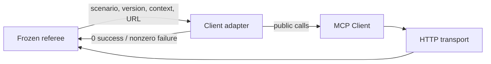
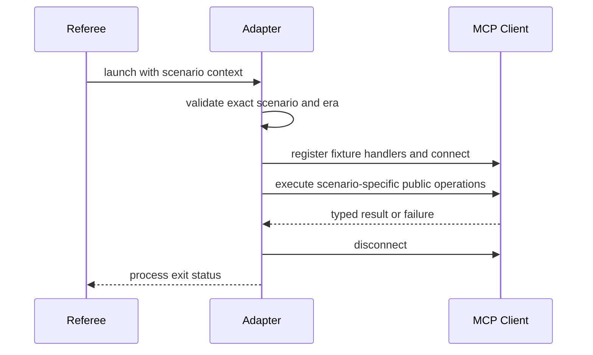

# Client Conformance Adapter

## Purpose and Scope

This executable target maps frozen MCP conformance scenario IDs to public
`MCP.Client` operations. It is a package-level test adapter, not an SDK layer.

Parent: [package master](../../../DESIGN.md). Children: none.

## Responsibilities and Boundaries

The adapter owns environment/argument parsing, exact scenario dispatch, fixture
handlers, and process exit status. It does not implement protocol negotiation,
OAuth policy, transport validation, retries, or result semantics. Those remain
owned by the `MCP` module and must be exercised through its public APIs.

## Related Designs

| Design | Relationship | Contract Used | Cautions |
| --- | --- | --- | --- |
| [Package master](../../../DESIGN.md) | parent | frozen client scenario inventory and gate | scenario IDs must remain exact |
| [Client](../../MCP/Client/DESIGN.md) | depends on | dual-era connect, requests, MRTR, and handlers | no adapter-side protocol fallback |
| [Authorization](../../MCP/Base/Authorization/DESIGN.md) | depends on through HTTP transport | OAuth configuration and typed failures | credentials and tokens are never logged |
| [Transport](../../MCP/Base/Transports/DESIGN.md) | depends on | HTTP request delivery | adapter does not reconstruct wire messages |

## Architecture

## Contracts and Invariants

| Contract | Guarantee |
| --- | --- |
| Scenario dispatch | Every supported frozen ID has an explicit handler; an unknown ID is a failure, never a generic success path. |
| Era dispatch | `MCP_CONFORMANCE_PROTOCOL_VERSION` selects the additive modern API only for `2026-07-28`; supported legacy versions use the unchanged legacy API. |
| Context | Structured `MCP_CONFORMANCE_CONTEXT` is decoded as MCP `Value`; malformed JSON is a typed adapter failure. |
| Behavioral evidence | A scenario performs the operations that its referee observes; connection alone is not reported as scenario success. |
| Secrets | OAuth credentials, assertions, and tokens are passed to SDK configuration but never written to logs. |

## Runtime Flows

## State, Ownership, and Lifecycle

The process owns one scenario, one Client, and one HTTP transport from launch
through disconnect or failure. Scenario context is immutable process input.
OAuth token and retry state remain owned by the SDK components.

## Failure, Concurrency, and Constraints

- Invalid arguments, versions, context, and unknown scenarios terminate with a
  nonzero exit status.
- Each referee process runs one scenario; cross-scenario caches or mutable
  global protocol state are forbidden.
- Request, OAuth, MRTR, and transport bounds are the SDK contracts; the runner
  owns the outer process timeout.

## Verification and Change Impact

The frozen client gate owns all 32 client scenario IDs for `2026-07-28`.
Focused execution of a changed scenario precedes one complete gate run. Changes
to scenario routing or era selection require rechecking the package master,
Client, Authorization, and Transport designs; adapter-only code cannot waive a
failing SDK contract.
