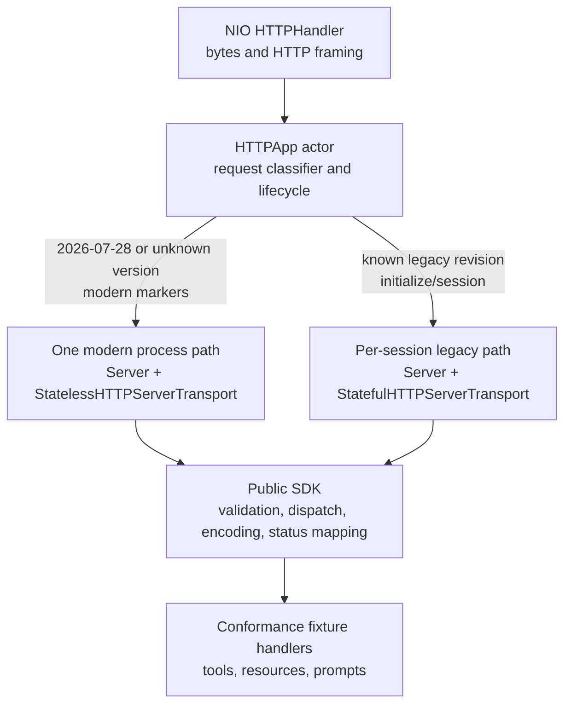
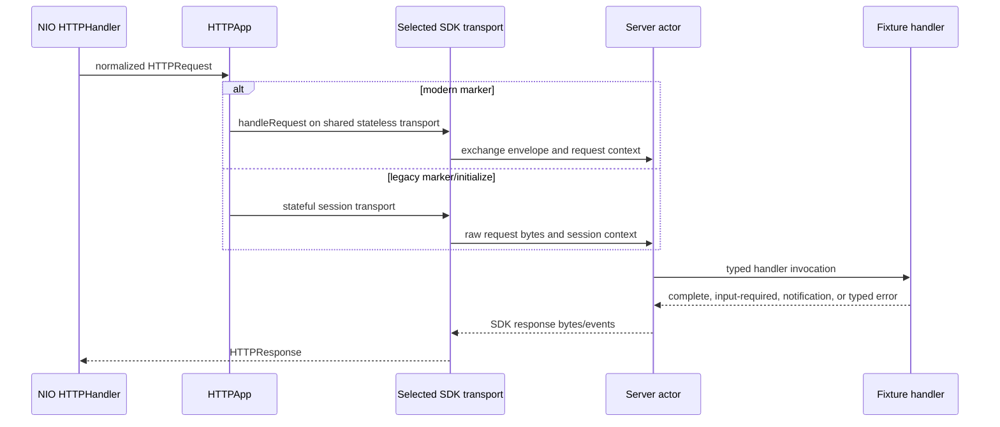
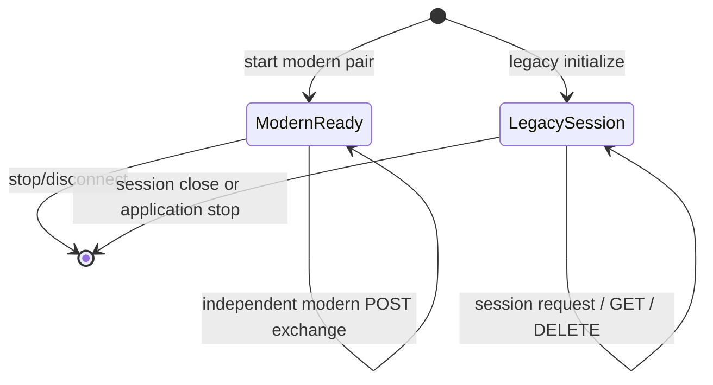

# Server Conformance Adapter

## Purpose and Scope

This module is the executable HTTP adapter used by the pinned MCP server
conformance suite. It exercises the public `Server` and HTTP server transport
contracts without implementing a second protocol stack.

Parent: [package design master](../../../DESIGN.md).

Children: none. The executable entry point and its NIO adapter are owned by
this module.

## Responsibilities and Boundaries

The adapter owns HTTP framing, process startup, request classification, and
the conformance fixture handlers. It creates one process-scoped modern
`Server`/`StatelessHTTPServerTransport` pair and creates an isolated
`Server`/`StatefulHTTPServerTransport` pair for each legacy session.

The adapter does not own MCP semantic validation, protocol version negotiation,
schema-derived headers, result encoding, MRTR wire validation, cache hints,
subscription acknowledgement, or HTTP status mapping. Those contracts remain
in the public SDK. Fixture code supplies application behavior and only uses
the SDK's typed results, errors, and notification APIs.

## Related Designs

| Design | Relationship | Contract Used | Cautions |
| --- | --- | --- | --- |
| [Package master](../../../DESIGN.md) | parent | dual-era compatibility and conformance scope | keep the adapter outside the production SDK module |
| [MCP module](../../MCP/DESIGN.md) | depends on | public `Server` orchestration API | use public handlers and lifecycle only |
| [Server orchestration](../../MCP/Server/DESIGN.md) | depends on | modern/legacy dispatch, MRTR, notifications, and error contracts | application state policy stays in this fixture |
| [Transport](../../MCP/Base/Transports/DESIGN.md) | depends on | stateful sessions and stateless exchange delivery | do not mix session IDs with modern exchanges |

## Architecture

The classifier only chooses an already-defined lifecycle. It does not decide
whether a request is valid; the selected transport and `Server` perform that
validation and return the typed result or error.

## Contracts and Invariants

| Contract | Guarantee |
| --- | --- |
| Modern routing | A request carrying `2026-07-28`, an unknown protocol version, a modern standard header, or modern request metadata is sent to the single stateless pair. |
| Legacy routing | A request carrying a supported legacy revision without modern markers follows the existing initialize/session path and never shares its server or transport state with another session. |
| Lifecycle | The modern pair is started once before HTTP binding and stopped once with the application. A legacy pair starts and stops with its session. |
| Identity | Modern `ExchangeID` and legacy `Mcp-Session-Id` are owned by their respective SDK transports; this adapter never maps either identity to a JSON-RPC ID. |
| Validation ownership | No protocol/header/schema/MRTR validation is duplicated here. Fixture handlers return `InputRequiredResult` and typed `MCPError` values through the SDK contracts. |
| Failure | Setup, dispatch, and fixture failures remain errors. Only the existing HTTP shutdown close is best-effort. |
| Fixture coverage | The server executable registers the 37 frozen server scenario targets, including diagnostic MRTR tools and prompts, while production SDK tests own the underlying semantic contracts. |

## Runtime Flows

### Request routing

### Lifecycle

## State, Ownership, and Lifecycle

| State | Owner | Lifetime |
| --- | --- | --- |
| HTTP channel | `HTTPApp` | bind through `stop()`/close |
| Modern server and transport | `HTTPApp` | app start through app stop; one pair for all modern POSTs |
| Legacy session map | `HTTPApp` | app lifetime; one entry per active session |
| Legacy server/transport pair | `HTTPApp` session context | session creation through disconnect/cleanup |
| Fixture resource state | `ServerState` actor | process lifetime; shared only as application fixture state |
| Modern exchange and response stream | stateless SDK transport | one admitted POST through terminal response/cancel/disconnect |

Modern requests do not create, reuse, or close a legacy session. Legacy
session cleanup does not stop the modern pair. `HTTPApp` owns only the
references needed to coordinate lifecycle; SDK actors own their protocol
state and response routing.

## Failure, Concurrency, and Constraints

- `HTTPApp` is an actor, so classifier, channel, and session-map mutations are
  serialized. Independent modern POST exchanges remain concurrent inside the
  SDK transport and `Server` actor.
- Modern setup failure disconnects the newly created transport and propagates
  the error before HTTP binding. It cannot leave a partially registered server
  that appears ready.
- Legacy factory failure cleans up the newly created session through the
  existing session path. Session timeout and server stop close only legacy
  sessions that `HTTPApp` owns.
- The adapter does not buffer response streams, retain MRTR continuation, or
  infer client capabilities. Each modern MRTR round is an independent request
  and the fixture decides whether an opaque `requestState` is acceptable.
- The existing `try?` at channel shutdown is intentionally limited to
  best-effort cleanup; request setup, fixture behavior, and transport errors
  are propagated or encoded by the SDK.

## Verification and Change Impact

The module is verified by a timed product build, focused live HTTP requests
that exercise both routing branches, and `git diff --check`. The pinned
external conformance runner is the proof boundary for all 37 scored fixture
results; a local smoke or product build does not replace that gate.

Changes to routing markers or lifecycle ownership require rechecking the
[Server orchestration](../../MCP/Server/DESIGN.md) and
[Transport](../../MCP/Base/Transports/DESIGN.md) contracts. Changes to fixture
names or response policy require rerunning the pinned 37-scenario server leg.
